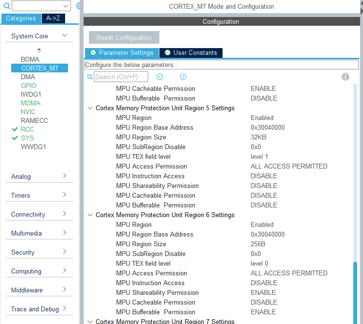
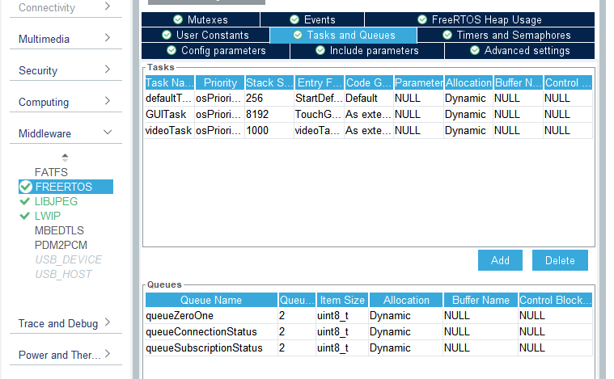

Author: Grzegorz Heller  
Created on: 30.11.2021  
Updated on: 12.04.2022  
Tested and found working on: 12.04.2022  

CubeIDE version: 1.9.0  
CubeMX version: 6.5.0  
TouchGFX version: 4.18.1  

Video demonstration of older version of this demo: https://youtu.be/hxHlEgOlPiU

# STM32H750B-DK_TouchGFX_FreeRTOS_MQTT_Example
## Introduction

 This guide should be a good starting point for creating an MQTT application with CubeIDE and TouchGFX on STM32H750B-DK development board. With adequate changes this will of course work also on other supported boards. I created this guide due to the lack of any comprehensive tutorials on MQTT for STM32H750B-DK that would work from the get-go. Due to the nature of this guide it is meant to be followed exactly as specified. This guide also assumes you know your way around the used tools, as I won't be going too in-depth. If you wish to know more, please consult the useful links section. If you find a step unclear and do not know how to follow, find any issues or have suggestions, feel free to contact me here: grzegorz4heller@gmail.com. 

 This guide will cover: 

 - creating a simple GUI in TouchGFX, 

 - configuring the hardware in MX for Ethernet, LWIP and MQTT, 

 - implementing very basic MQTT functionality with ability to connect to a broker and subscribe to a topic over the unencrypted port 1883, 

 - getting server IP using DNS, this way we can connect to brokers in the cloud, 

 - sending data between MQTT and TouchGFX tasks using queues. 

## Useful links
### STM32H750B-DK
Official ST tutorials for H7:  
https://www.st.com/content/st_com/en/support/learning/stm32-education/stm32-online-training/stm32h7-online-training.html  

Official ST example projects for STM32H750B-DK:  
https://github.com/STMicroelectronics/STM32CubeH7/tree/master/Projects/STM32H750B-DK  

### TouchGFX
TouchGFX docs:  
https://support.touchgfx.com/docs/introduction/welcome  

Introduction to TouchGFX by embryonic.dk:  
https://www.youtube.com/watch?v=9QDWti5RzBU  

Tutorial on creating a more advanced GUI application with TouchGFX by EE by Karl:  
https://www.youtube.com/watch?v=uE6eiTjOP-g  

How to enable "Generate peripheral initialization as a pair of '.c/.h' files per peripheral" without getting a white screen:  
https://community.st.com/s/question/0D53W00001DkHUrSAN/white-screen-after-checking-generate-peripheral-initialization-as-a-pair-of-ch-files-per-peripheral-in-cubemx  

### Ethernet and LWIP
Tutorial on Ethernet configuration by Controllers Tech:  
https://www.youtube.com/watch?v=8r8w6mgSn1A  

Another useful information about Ethernet configuration:  
https://community.st.com/s/article/FAQ-Ethernet-not-working-on-STM32H7x3  

Tutorial on how to make LWIP stack working:  
https://community.st.com/s/article/How-to-create-project-for-STM32H7-with-Ethernet-and-LwIP-stack-working  

### FreeRTOS, newlib and reentrancy
Newlib and reentrancy with FreeRTOS:  
https://nadler.com/embedded/newlibAndFreeRTOS.html  

A useful thread about reentrancy and newlib issues:  
https://forums.freertos.org/t/why-does-rand-or-random-return-0-in-threads-but-is-ok-in-main/10065  

### MQTT
Official LWIP MQTT docs:  
https://www.nongnu.org/lwip/2_0_x/group__mqtt.html  

Tutorial on paho MQTT by eziya:  
https://github.com/eziya/STM32F4_HAL_ETH_MQTT_CLIENT  

Tutorial on LWIP MQTT by M.f.abouHASHEM:  
https://www.youtube.com/watch?v=8P3_R6Xmhb0&t=2s  

Tutorial on LWIP MQTT for STM32F407:  
https://chowdera.com/2022/01/202201061820128535.html  

# 1. TouchGFX

 Start with creating a project for STM32H750B-DK by selecting the template. As suggested in the description, the template won't work with different version of TouchGFX (I have personally tested this with TouchGFX v4.19.1, there are errors because of undefined references to new functions). 

   

 Create a similar interface. Don't worry about placing everything exactly as me. The background image is one of the stock images you can set from properties. It doesn't mater which one you choose. I will explain how to get the zero and one images in a moment. 

  

 It is important to have the same resource names as here to avoid naming issues later. Remember to change the screen name too! 

  

 In order to get the zero and one images you have to put the attached zero.png and one.png files into your project images using the + button in upper right corner. 

  

 These two images should be hidden by default, but it is not crucial. 

  

 Create a wildcard for the textArea. The buffer size should be 4, because the longest word we will put into it is "yes" and we need to add one more character to it, the null terminator "\0", which results in buffer length of 4. 

  

 We are using the Default typography here. In order to change text on runtime, we have to edit the typography, because the necessary characters have to be generated. That's why we have to type in the Wildcard Characters we want to use on runtime. Since we're just using 5 characters, there is no need to input an entire range. 

  

 Create two interactions exactly like this. These functions will be auto generated in ScreenMainBase.hpp and also will be called on the respective button press. The usual routine is then to overload them in our class and implement the functionality we want. 

  

 Generate the code. 

   

 Open the project folder straight from TouchGFX by clicking the Files button in lower left corner. 

  

 You can now close TouchGFX. 

# 2. CubeMX

 Import the Cube project by going to STM32CubeIDE folder inside the root folder of your whole project and launching the .cproject file. Open the .ioc file from within the workspace. If you get prompted for migration to new version, don't do this by pressing Continue. I couldn't make this project work after migrating. 

  

 Enabling the Ethernet module in Connectivity section is prevented by pin conflict. This can be "fixed" by unassigning the PA2 pin labeled LCD_RESET. Simply find it on the pinout view and press Reset_State. 

  

 Now we can enable Ethernet module in the Connectivity section. Also enable Ethernet global interrupt with preemption priority 5 in the NVIC settings. 

  

 Now check if your Parameter Settings are correct. 

  

 You should be careful with this module's pinout as some users reported the default one could be wrong. If you are unsure, check the datasheet/schematic of your board. Assuming you are using the same board as me, you should be fine with my settings. 

  

 Now enter CORTEX_M7 in System Core section and add these two regions. Pay attention to the MPU Region Size. 

  

 Enable LWIP in Middleware section. There are two routes here. The first one is the easier one - enabling DHCP. If you can use it, I see no point in not using it. The second route is setting a static IP. I will explain how to do this after explaining the DHCP. Also enable the LWIP_DNS no matter if you use DHCP or static IP. 

  

 In Key Options, enable the Show Advanced Parameters in the top right corner. Set the MEM_SIZE and LWIP_RAM_HEAP_POINTER as shown below. 

  

 This part is very important for MQTT. We have to increase the MEMP_NUM_SYS_TIMEOUT by 1 in order to enable the cyclic timer responsible for MQTT Keep Alive functionality. In my case the description says the minimal value should be 6, so I set it to 7. 

  

 Set the platform. 

  

 Increase the MINIMAL_STACK_SIZE of FreeRTOS just in case. 

  

 Enable USE_NEWLIB_REENTRANT in Advanced settings. 

  

 Create three queues used to communicate between MQTT and TGFX tasks. 

  

 I will be using generate peripheral initialization as a pair of '.c/.h' files per peripheral option and I recommend doing the same to avoid extremely large size of main.c. The code I am providing is also written with this option in mind. This however requires us to take additional action, which I will be explaining in a moment. You can also read about it in useful links section. So, before you generate the code, backup your main.c file! This file is located in Root/Core/Src folder. It is also important to note that there is a bug causing this option to be disabled randomly. Well, it isn't exactly random but I haven't found out what causes it yet. So every time you want to regenerate the code in MX, check if this option is enabled! Otherwise it will mess up your project. 

  

  

 Generate the code. You can turn off MX after. 

## Static IP

 To enable Static IP you have to know what IP and NETMASK to choose. I cannot help you with that. My values are as follow. 

  

 Everything else should be the same as for DHCP, except for MEMP_NUM_SYS_TIMEOUT which in my case can be now as low as 5. 

# 3. CubeIDE

 Try building the project right away. If you get an error like below, set a flag in properties as per the screenshot. 

  

  

 The project should build nicely now, but if you try flashing the board with it, you will get a white screen. This is because of the peripheral initialization option we have enabled. This has caused the custom code provided by the TouchGFX template to disappear. We can put it back thanks to our backup of main.c. We won't have to do this a second time, unless you forget the bug I mentioned and generate the whole initialization back in main.c. Don't forget! 

 I have provided the already completed files for this template. However I advise taking a look at how to do this yourself. Open your backup main.c and find every user code section with some code in it. You have to copy this code and put it back into adequate place. In case of this project, the sections are as follows: 

 - USER CODE BEGIN Includes, one #include has to go to quadspi.c and one has to go to fmc.c, into sections called USER CODE BEGIN 0, 

 - USER CODE BEGIN QUADSPI_Init 0, 

 - USER CODE BEGIN QUADSPI_Init 2, 

 - USER CODE BEGIN FMC_Init 2. 

 With this out of the way, there are two more things to do in order to get rid of the white screen. We have to remove the sysmem.c file from our workspace. This file's code causes various issues, the project will most probably not work with it. If we remove it, it is replaced with a working version. 

   

 Next, let's make the appropriate changes to the STM32H750XBHX_FLASH.ld file. Add the following section to the file. 

  

      /* Modification start */
      .lwip_sec (NOLOAD) : {
        . = ABSOLUTE(0X30040000);
        *(.RxDecripSection)
    
        . = ABSOLUTE(0X30040060);
        *(.TxDecripSection)
    
        . = ABSOLUTE(0X30040200);
        *(.RxArraySection)
      } >RAM_D2
      /* Modification end */

 These addresses correspond to the adressess we have set for Ethernet in MX. You can find them specified in ethernetif.c file. 

 For better workflow, you can include the .touchgfx file into your workspace by dragging it onto the project and selecting link to files. You can then easily launch TouchGFX from within the workspace and run them simultaneously. 

   

 Now comes an important step for Keep Alive functionality. This functionality is responsible for periodically pinging the broker and receiving ping response. The cyclic timer responsible for this is set by default to be called every 5 seconds. It is implemented in such a way that if time on current call is higher than Keep Alive, it will send a PINGREQ packet. However, if the time on current call is higher than 1.5 * Keep Alive, it will consider the server unresponsive and disconnect. You can analyze this funcion in mqtt.c, it's called mqtt_cyclic_timer. This creates issues if we set the Keep Alive time to a low value, because the device will disconnect itself if cyclic timer is too slow. Generally low values should be unnecessary, but we will set it low in this example. To make this work we have to find the lwipopts.h file. Easiest way is to go this way: main.c -> lwip.h -> opt.h -> lwipopts.h. This file contains all custom settings for LWIP. We can set the MQTT_CYCLIC_TIMER_INTERVAL here to something else than 5. Let's set it to 1. The original value is set in mqtt_opts.h, but it is protected with #ifndef so don't worry about redefinition. Now our cyclic timer should be fired every 1 second, which means setting Keep Alive time to 4 seconds should cause no issues. You can also notice that the MEMP_NUM_SYS_TIMEOUT alongside other variables we have set in MX is also defined in this file. 

  

 After all this you can overwrite your project files with the files provided. It should work almost from the get-go, you just have to input the local IP of the device hosting the broker on your network in MQTT_Interface.c file (if you run it on your PC, it's your PC's IP). Look for a section called CODE TO CHANGE. Remember to add the new MQTT folder into the include path. If you don't see the folder in your workspace, refresh a couple times. Build the project and run the code on your board. 

  

  

# 4. Testing

 You have to have Mosquitto installed to test the device now. Alternatively you can go into MQTT_Interface.c and comment/uncomment adequate code sections to connect to test.mosquitto.org if you have a way of testing the connection there. You can write some code to publish a message and receive it on another subscribed client, for example MQTT Explorer. Testing the application should be simple. Just plug in the device into your router and press the Connect button. Your Mosquitto should display something like below. There might be a slight delay in response - the LWIP takes it's time to initialize. 

  

 After a couple of seconds you should see ping activity. 

  

 Pressing the disconnect button should result in a properly closed connection. 

  

 I have also provided my Mosquitto configuration file. To run Mosquitto with a configuration file, open CMD and navigate to your Mosquitto installation folder, then use this command with the path to your configuration file:  
mosquitto -c d:\mosquitto\configuration.conf -v 

 If you have another MQTT client, you can publish 0 or 1 to test/topic to change the displayed image. I am using MQTT Explorer like below. 

  

 If you don't have direct access to your router, you can use your PC's LAN port. This should work this way too, however you will have to change some settings on your PC regarding Internet sharing, and possibly open MQTT port 1883 in Firewall. However I cannot at the moment confirm this works. 

# 5. Conclusion

 Hopefully you now have a very basic, but working device utilising MQTT communication. You can now analyse the code and extend the project to suit your needs. I have added some simple comments here and there to help you with this. 

