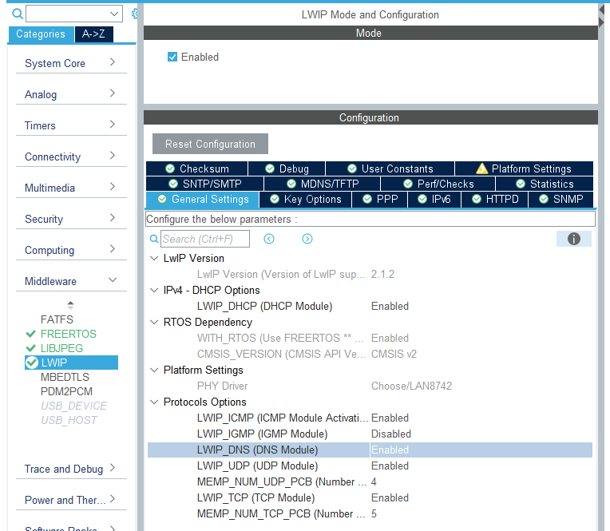
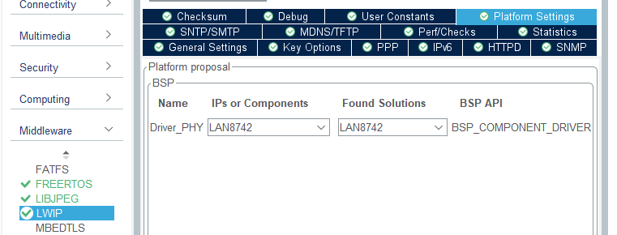
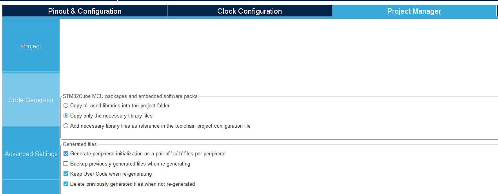

Author: Grzegorz Heller  
Created on: 30.11.2021  
Updated on: 12.04.2022  
Tested and found working on: 12.04.2022  

CubeIDE version: 1.9.0  
CubeMX version: 6.5.0  
TouchGFX version: 4.18.1  

Video demonstration of older version of this demo: https://youtu.be/hxHlEgOlPiU

# WORK IN PROGRESS

# STM32H750B-DK_TouchGFX_FreeRTOS_MQTT_Example
## Introduction

 This guide is a good starting point for creating an MQTT application with CubeIDE and TouchGFX on STM32H750B-DK development board. With adequate changes this will of course work also on other supported boards. I created this guide due to the lack of any comprehensive tutorials on MQTT for STM32H750B-DK that would work from the get-go. Due to the nature of this guide it is meant to be followed exactly as specified. This guide also assumes you know your way around the used tools, as I won't be going too in-depth. If you wish to know more, please consult the useful links section. If you find a step unclear and do not know how to follow, find any issues or have suggestions, feel free to contact me here: grzegorz4heller@gmail.com. 

 This guide will cover: 

 - creating a simple GUI in TouchGFX, 

 - configuring the hardware in MX for Ethernet, LWIP and MQTT, 

 - implementing very basic MQTT functionality with ability to connect to a broker and subscribe to a topic, 

 - sending data between MQTT and TouchGFX tasks using queues. 

## Useful links
### STM32H750B-DK
Official ST tutorials for H7:  
https://www.st.com/content/st_com/en/support/learning/stm32-education/stm32-online-training/stm32h7-online-training.html  

Official ST example projects for STM32H750B-DK:  
https://github.com/STMicroelectronics/STM32CubeH7/tree/master/Projects/STM32H750B-DK  

### TouchGFX
TouchGFX docs:  
https://support.touchgfx.com/docs/introduction/welcome  

Introduction to TouchGFX by embryonic.dk:  
https://www.youtube.com/watch?v=9QDWti5RzBU  

Tutorial on creating a more advanced GUI application with TouchGFX by EE by Karl:  
https://www.youtube.com/watch?v=uE6eiTjOP-g  

How to enable "Generate peripheral initialization as a pair of '.c/.h' files per peripheral" without getting a white screen:  
https://community.st.com/s/question/0D53W00001DkHUrSAN/white-screen-after-checking-generate-peripheral-initialization-as-a-pair-of-ch-files-per-peripheral-in-cubemx  

### Ethernet and LWIP
Tutorial on Ethernet configuration by Controllers Tech:  
https://www.youtube.com/watch?v=8r8w6mgSn1A  

Another useful information about Ethernet configuration:  
https://community.st.com/s/article/FAQ-Ethernet-not-working-on-STM32H7x3  

Tutorial on how to make LWIP stack working:  
https://community.st.com/s/article/How-to-create-project-for-STM32H7-with-Ethernet-and-LwIP-stack-working  

### FreeRTOS, newlib and reentrancy
Newlib and reentrancy with FreeRTOS:  
https://nadler.com/embedded/newlibAndFreeRTOS.html  

A useful thread about reentrancy and newlib issues:  
https://forums.freertos.org/t/why-does-rand-or-random-return-0-in-threads-but-is-ok-in-main/10065  

### MQTT
Official LWIP MQTT docs:  
https://www.nongnu.org/lwip/2_0_x/group__mqtt.html  

Tutorial on paho MQTT by eziya:  
https://github.com/eziya/STM32F4_HAL_ETH_MQTT_CLIENT  

Tutorial on LWIP MQTT by M.f.abouHASHEM:  
https://www.youtube.com/watch?v=8P3_R6Xmhb0&t=2s  

Tutorial on LWIP MQTT for STM32F407:  
https://chowdera.com/2022/01/202201061820128535.html  

# 1. TouchGFX

 Start with creating a project for STM32H750B-DK by selecting the template. As suggested in the description, the template won't work with different version of TouchGFX (I have personally tested this with TouchGFX v4.19.1, there are errors because of undefined references to new functions). 

   

 Create a similar interface. Don't worry about placing everything exactly as me. The background image is one of the stock images you can set from properties. It doesn't mater which one you choose. I will explain how to get the zero and one images in a moment. 

  

 It is important to have the same resource names as here to avoid naming issues later. Remember to change the screen name too! 

  

 In order to get the zero and one images you have to put the attached zero.png and one.png files into your project images using the + button in upper right corner. 

  

 These two images should be hidden by default, but it is not crucial. 

  

 Create a wildcard for the textArea. The buffer size should be 4, because the longest word we will put into it is "yes" and we need to add one more character to it, the null terminator "\0", which results in buffer length of 4. 

  

 We are using the Default typography here. In order to change text on runtime, we have to edit the typography, because the necessary characters have to be generated. That's why we have to type in the Wildcard Characters we want to use on runtime. 

  

 Create two interactions exactly like this. These functions will be auto generated in ScreenMainBase.hpp and also will be called on the respective button press. The usual routine is then to overload them in our class and implement the functionality we want. 

  

 Generate the code. 

   

 Open the project folder straight from TouchGFX by clicking the Files button in lower left corner. 

  

 You can now close TouchGFX. 

# 2. CubeMX

 Import the Cube project by going to STM32CubeIDE folder inside the root folder of your whole project and launching the .cproject file. Open the .ioc file from within the workspace. If you get prompted for migration to new version, you can either don't do this by pressing Continue, or update by pressing Migrate. I chose to Migrate because I know it won't mess up my project this time. Your experience may vary. 

  

 Enabling the Ethernet module in Connectivity section is prevented by pin conflict. This can be "fixed" by unassigning the PA2 pin labeled LCD_RESET. Simply find it on the pinout view and press Reset_State. 

  

 Now we can enable Ethernet module in the Connectivity section. Also enable Ethernet global interrupt with preemption priority 5 in the NVIC settings. 

  

 You should be careful with this module's pinout as some users reported the default one could be wrong. If you are unsure, check the datasheet/schematic of your board. Assuming you are using the same board as me, you should be fine with my settings. 

  

 Now enter CORTEX_M7 in System Core section and add these two regions. Pay attention to the MPU Region Size. 

  

 Enable LWIP in Middleware section. There are two routes here. The first one is the easier one - enabling DHCP. If you can use it, I see no point in not using it. The second route is setting a static IP. I will explain how to do this after explaining the DHCP. Also enable the LWIP_DNS no matter if you use DHCP or static IP. 

  

 In key options, enable the Show Advanced Parameters in the top right corner. Set the MEM_SIZE and LWIP_RAM_HEAP_POINTER as shown below. 

  

 This part is very important for MQTT. We have to increase the MEMP_NUM_SYS_TIMEOUT by 1 in order to enable the cyclic timer responsible for MQTT Keep Alive functionality. In my case the description says the minimal value should be 6, so I set it to 7. 

  

 Set the platform. 

  

 Increase the MINIMAL_STACK_SIZE of FreeRTOS just in case. 

  

 Enable USE_NEWLIB_REENTRANT in Advanced settings. 

  

 Create three queues used to communicate between MQTT and TGFX tasks. 

  

 I will be using generate peripheral initialization as a pair of '.c/.h' files per peripheral option and I recommend doing the same to avoid extremely large size of main.c. The code I am providing is also written with this option in mind. This however requires us to take additional action, which I will be explaining in a moment. You can also read about it in useful links section. So, before you generate the code, backup your main.c file! This file is located in Root/Core/Src folder. It is also important to note that there is a bug causing this option to be disabled randomly. Well, it isn't exactly random but I haven't found out what causes it yet. So every time you want to regenerate the code in MX, check if this option is enabled! Otherwise it will mess up your project. 

   

 Generate the code. You can turn off MX after. 

# 3. CubeIDE

 Include the .touchgfx file into your workspace by dragging it onto the project and selecting link to files. 

   

 This is the part which caused me the most trouble. There are three very important steps we should do first here. Firstly, let's make the appropriate changes to the FLASH.ld file. Add the following section to the file. 

  

      /* Modification start */
      .lwip_sec (NOLOAD) : {
        . = ABSOLUTE(0X30040000);
        *(.RxDecripSection)
    
        . = ABSOLUTE(0X30040060);
        *(.TxDecripSection)
    
        . = ABSOLUTE(0X30040200);
        *(.RxArraySection)
      } >RAM_D2
      /* Modification end */

 These addresses correspond to the sections we have set in CORTEX_M7 in MX. You can find them specified in ethernetif.c file. 

 The PINGREQ functionality is disabled by default. To enable it, find lwipopts.h file (lwip.h -> opt.h -> lwipopts.h) and redefine the MEMP_NUM_SYS_TIMEOUT macro as follows in the user code section 1 at the end of the file. The value of this define depends on your configuration. Generally, the PINGREQ should work if you increase the value defined in lwipopts.h by 1. My default value was 5, this is why I'm redefining it as 6. 

    /* USER CODE BEGIN 0 */
    #undef MEMP_NUM_SYS_TIMEOUT
    #define MEMP_NUM_SYS_TIMEOUT 6
	/* USER CODE END 0 */

 Please remember that after extending this project these values might change. You should be aware of what modules you enable, but you can always double check yourself by finding these defines in opt.h/lwipopts.h which will always be generated based on your MX settings. 

 Last important thing to do is to remove the sysmem.c file from the project. This file's code causes issues with code reentrancy, which invariably causes hardfault errors in this project. If we remove it it is replaced with a working version. 

  

 After all this you can overwrite your project files with the files provided here. Remember to add the new MQTT folder into the include path. Build the project and run the code on your board. 

# 4. Windows 10

 Testing the application with static IP requires you to make some changes in your Ethernet configuration. 

  

 Upon connecting your device to the PC over LAN, a network should be created, allowing to start up a broker under the gateway address we have set up in CubeMX. This step may be troublesome, because the network doesn't always change to the gateway address we have set. I don't know how to make it work immediately. Just try until you succeed. If everything went as planned, you now should be able to see something like this after pressing the Subscribe button. Your device should also be sending PINGREQ message about every 10 seconds (this is it's keep alive time). 

  

 Just to be safe I have also provided my Mosquitto configuration file. To run Mosquitto with a configuration file, use this command with the path to your configuration file:  
mosquitto -c c:\mosquitto\configuration.conf -v 

 Alternatively, if you are using DHCP, change the IP address to 0.0.0.0 in the config file provided. Remember to change the broker IP in the MQTT_Interface.c file to the IP of the machine you are running the broker on. Connect the board to your router. 

# 5. Conclusion

 Hopefully you now have a very basic, but working device utilising MQTT communication and a project that did not cost you hours of your time figuring out why something doesn't work. You can analyse the code or look into the provided links to find out more and go from there. 

