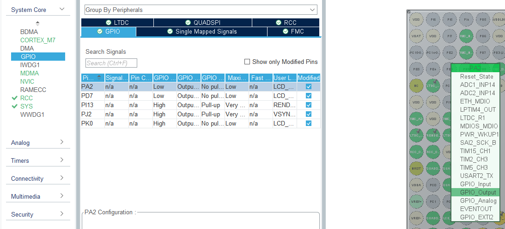
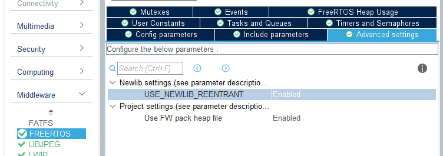

Author: Grzegorz Heller  
Created on: 30.11.2021  
Updated on: 04.04.2022  
Tested and found working on: 23.12.2021  

CubeIDE version: 1.8.0  
CubeMX version: 6.4.0  
TouchGFX version: 4.18.1  

Video demonstration: https://youtu.be/hxHlEgOlPiU

# STM32H750B-DK_TouchGFX_FreeRTOS_MQTT_Example
## Introduction

 This is a guide on how to create a working MQTT application with TouchGFX on STM32H750B-DK development board. This guide covers all issues I have encountered during the setup of my MQTT project so that you will hopefully be able to painlessly create a working sample project and go from there. I created this guide due to the lack of any comprehensive tutorials on MQTT for STM32H750B-DK I have found. Follow these instructions carefully and exactly as specified, otherwise you will encounter issues, for example naming conflicts or hardfaults. This guide assumes you know your way around the used tools. I won't be explaining much here. If you wish to know why I did what I did, please consult the useful links section. If you find a step unclear and do not know how to follow, find any other issues or have suggestions, feel free to contact me here: grzegorz4heller@gmail.com. 

## Useful links
### STM32H750B-DK
Official ST "tutorials" for H7:  
https://www.st.com/content/st_com/en/support/learning/stm32-education/stm32-online-training/stm32h7-online-training.html  

Official ST example projects for STM32H750B-DK:  
https://github.com/STMicroelectronics/STM32CubeH7/tree/master/Projects/STM32H750B-DK  

### TouchGFX
TouchGFX docs:  
https://support.touchgfx.com/docs/introduction/welcome  

Introduction to TouchGFX by embryonic.dk:  
https://www.youtube.com/watch?v=9QDWti5RzBU  

Tutorial on creating a more advanced GUI application with TouchGFX by EE by Karl:  
https://www.youtube.com/watch?v=uE6eiTjOP-g  

How to enable "Generate peripheral initialization as a pair of '.c/.h' files per peripheral" without getting a white screen:  
https://community.st.com/s/question/0D53W00001DkHUrSAN/white-screen-after-checking-generate-peripheral-initialization-as-a-pair-of-ch-files-per-peripheral-in-cubemx  

### Ethernet and LWIP
Tutorial on Ethernet configuration by Controllers Tech:  
https://www.youtube.com/watch?v=8r8w6mgSn1A  

Another useful information about Ethernet configuration:  
https://community.st.com/s/article/FAQ-Ethernet-not-working-on-STM32H7x3  

Tutorial on how to make LWIP stack working:  
https://community.st.com/s/article/How-to-create-project-for-STM32H7-with-Ethernet-and-LwIP-stack-working  

### FreeRTOS, newlib and reentrancy
Newlib and reentrancy with FreeRTOS:  
https://nadler.com/embedded/newlibAndFreeRTOS.html  

A useful thread about reentrancy and newlib issues:  
https://forums.freertos.org/t/why-does-rand-or-random-return-0-in-threads-but-is-ok-in-main/10065  

### MQTT
Official LWIP MQTT docs:  
https://www.nongnu.org/lwip/2_0_x/group__mqtt.html  

Tutorial on paho MQTT by eziya:  
https://github.com/eziya/STM32F4_HAL_ETH_MQTT_CLIENT  

Tutorial on LWIP MQTT by M.f.abouHASHEM:  
https://www.youtube.com/watch?v=8P3_R6Xmhb0&t=2s  

# 1. TouchGFX
Start by creating a project for STM32H750B-DK by selecting the template.  

   

Create a similar interface.  

  

It is important to have the same resource names as here to avoid naming issues later.  

  

In order to get the zero and one images you have to put the attached zero.png and one.png files into your project images.  

  

These two images should be hidden by default, but it is not crucial.  

  

Create a wildcard for the textArea.  

  

To prevent issues it may be necessary to put a couple characters into the wildcard typography.  

  

Create two interactions exactly like this.  

  

Generate the code. If the white circle doesn't disappear after the first generation, generate again just to be safe.  

# 2. CubeMX

 Import the Cube project by going to STM32CubeIDE folder inside the root folder of your TouchGFX project and launching the .cproject or .project file. Open the .ioc file from within the workspace. The order of the following steps should not matter much. 

 Enabling the ETHERNET module in Connectivity tab is prevented by pin conflict. This can be "fixed" by unassigning the PA2 pin labeled LCD_RESET. 

  

 Now we can enable ETHERNET module. Also enable Ethernet global interrupt with Preemption Priority 5. 

  

  

 You should be careful with this module's pinout as some users reported the default one could be wrong. If you are unsure, check the datasheet/schematic of your board. Assuming you are using the same board as me, you should be fine with my settings. 

  

 Now enter CORTEX_M7 in System Core and add these two sections. 

  

 Enable LWIP. At first I have been using static IP address as shown on the screenshot and the code provided here is written to accommodate that. However I have switched to DHCP later. If you want to follow this guide 1:1, set the static IP address of the device. Depending on your local network you might need to adjust this and remember about changing some code. 

  

 Set the MEM_SIZE and LWIP_RAM_HEAP_POINTER as shown below. 

  

 Set the platform. 

  

 Increase the MINIMAL_STACK_SIZE of FreeRTOS just in case. 

  

 I prefer enabling NEWLIB to prevent the annoying warning. 

  

 Create three queues used to communicate between MQTT and TGFX tasks. 

  

 If you want to use "Generate peripheral initialization as a pair of '.c/.h' files per peripheral" option, consult useful links section. Generate the code. 

# 3. CubeIDE

 This is the part which caused me the most trouble. There are three very important steps we should do first here. Firstly, let's make the appropriate changes to the FLASH.ld file. Add the following section to the file. 

  

      /* Modification start */
      .lwip_sec (NOLOAD) : {
        . = ABSOLUTE(0X30040000);
        *(.RxDecripSection)
    
        . = ABSOLUTE(0X30040060);
        *(.TxDecripSection)
    
        . = ABSOLUTE(0X30040200);
        *(.RxArraySection)
      } >RAM_D2
      /* Modification end */

 These addresses correspond to the sections we have set in CORTEX_M7 in MX. You can find them specified in ethernetif.c file. 

 The PINGREQ functionality is disabled by default. To enable it, find lwipopts.h file (lwip.h -> opt.h -> lwipopts.h) and redefine the MEMP_NUM_SYS_TIMEOUT macro as follows in the user code section 1 at the end of the file. The value of this define depends on your configuration. Generally, the PINGREQ should work if you increase the value defined in lwipopts.h by 1. My default value was 5, this is why I'm redefining it as 6. 

    /* USER CODE BEGIN 0 */
    #undef MEMP_NUM_SYS_TIMEOUT
    #define MEMP_NUM_SYS_TIMEOUT 6
	/* USER CODE END 0 */

 Please remember that after extending this project these values might change. You should be aware of what modules you enable, but you can always double check yourself by finding these defines in opt.h/lwipopts.h which will always be generated based on your MX settings. 

 Last important thing to do is to remove the sysmem.c file from the project. This file's code causes issues with code reentrancy, which invariably causes hardfault errors in this project. 

  

 After all this you can overwrite your project files with the files provided here. Remember to add the new MQTT folder into the include path. Build the project and run the code on your board. 

# 4. Windows 10

 Testing the application with static IP requires you to make some changes in your Ethernet configuration. 

  

 Upon connecting your device to the PC over LAN, a network should be created, allowing to start up a broker under the gateway address we have set up in CubeMX. This step may be troublesome, because the network doesn't always change to the gateway address we have set. I don't know how to make it work immediately. Just try until you succeed. If everything went as planned, you now should be able to see something like this after pressing the Subscribe button. Your device should also be sending PINGREQ message about every 10 seconds (this is it's keep alive time). 

  

 Just to be safe I have also provided my Mosquitto configuration file. To run Mosquitto with a configuration file, use this command with the path to your configuration file:  
mosquitto -c c:\mosquitto\configuration.conf -v 

 Alternatively, if you are using DHCP, change the IP address to 0.0.0.0 in the config file provided. Remember to change the broker IP in the MQTT_Interface.c file to the IP of the machine you are running the broker on. Connect the board to your router. 

# 5. Conclusion

 Hopefully you now have a very basic, but working device utilising MQTT communication and a project that did not cost you hours of your time figuring out why something doesn't work. You can analyse the code or look into the provided links to find out more and go from there. 

