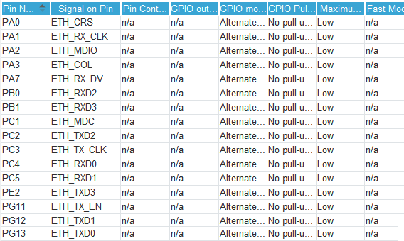

Author: Grzegorz Heller  
Created on: 30.11.2021  
Updated on: 17.12.2021

# STM32H750B-DK_TouchGFX_FreeRTOS_MQTT_Example
## Introduction
This is a guide on how to create a working MQTT application with TouchGFX on STM32H750B-DK development board.  
This guide covers all issues I have encountered during the setup of my MQTT project.  
I created this guide due to the lack of any comprehensive tutorials on MQTT for STM32H750B-DK.  
Follow these instructions carefully and exactly as specified, otherwise you will encounter issues, for example naming conflicts.  
This guide assumes you know your way around the used tools.  

## Useful links
### STM32H750B-DK
Official ST "tutorials" for H7:  
https://www.st.com/content/st_com/en/support/learning/stm32-education/stm32-online-training/stm32h7-online-training.html  

Official ST example projects for STM32H750B-DK:  
https://github.com/STMicroelectronics/STM32CubeH7/tree/master/Projects/STM32H750B-DK  

### TouchGFX
TouchGFX docs:  
https://support.touchgfx.com/docs/introduction/welcome  

Introduction to TouchGFX by embryonic.dk:  
https://www.youtube.com/watch?v=9QDWti5RzBU  

Tutorial on creating a more advanced GUI application with TouchGFX by EE by Karl:  
https://www.youtube.com/watch?v=uE6eiTjOP-g  

How to enable "Generate peripheral initialization as a pair of '.c/.h' files per peripheral" without getting a white screen:  
https://community.st.com/s/question/0D53W00001DkHUrSAN/white-screen-after-checking-generate-peripheral-initialization-as-a-pair-of-ch-files-per-peripheral-in-cubemx  

### Ethernet and LWIP
Tutorial on Ethernet configuration by Controllers Tech:  
https://www.youtube.com/watch?v=8r8w6mgSn1A  

Another useful information about Ethernet configuration:  
https://community.st.com/s/article/FAQ-Ethernet-not-working-on-STM32H7x3  

Tutorial on how to make LWIP stack working:  
https://community.st.com/s/article/How-to-create-project-for-STM32H7-with-Ethernet-and-LwIP-stack-working  

### FreeRTOS, newlib and reentrancy
Newlib and reentrancy with FreeRTOS:  
https://nadler.com/embedded/newlibAndFreeRTOS.html  

A useful thread about reentrancy and newlib issues:  
https://forums.freertos.org/t/why-does-rand-or-random-return-0-in-threads-but-is-ok-in-main/10065  

### MQTT
Official LWIP MQTT docs:  
https://www.nongnu.org/lwip/2_0_x/group__mqtt.html  

Tutorial on paho MQTT by eziya:  
https://github.com/eziya/STM32F4_HAL_ETH_MQTT_CLIENT  

Tutorial on LWIP MQTT by M.f.abouHASHEM:  
https://www.youtube.com/watch?v=8P3_R6Xmhb0&t=2s  

# 1. TouchGFX
Start by creating a project for STM32H750B-DK by selecting the template.  

   

Create a similar interface.  

  

It is important to have the same resource names as here to avoid naming issues later.  

  

In order to get the zero and one images you have to put the attached zero.png and one.png files into your project images.  

  

These two images should be hidden by default, but it is not crucial.  

  

Create a wildcard for the textArea.  

  

To prevent issues it may be necessary to put a couple characters into the wildcard typography.  

  

Create two interactions exactly like this.  

  

Generate the code. If the white circle doesn't disappear after the first generation, generate again just to be safe.  

# 2. CubeMX
Import the Cube project by going to STM32CubeIDE folder inside the root folder of your TouchGFX project and launching the .cproject or .project file.  
Open the .ioc file from withing the workspace. The order of the following steps should not matter much.  
Enabling the ETHERNET module in Connectivity tab is prevented by pin conflict. This can be "fixed" by unassigning the PA2 pin labeled LCD_RESET. I do not know whether the role of LCD_RESET could be assigned to another pin and was not interested in finding out yet.  

  

Now we can enable ETHERNET module. Also enable Ethernet global interrupt with Preemption Priority 5.  

  

  

You should be careful with this module's pinout as some users reported the default one could be wrong. If you are unsure, check the datasheet/schematic of your board. Assuming you are using the same board as me, you should be fine with my settings.  

  

Now enter CORTEX_M7 in System Core and add these two sections.  

  

Enable LWIP. Thus far I have been using static IP address. Set the IP address of the device.  

  

Set the MEM_SIZE and LWIP_RAM_HEAP_POINTER as shown below.  

  

Lastly set the platform.  

  

If you want to use "Generate peripheral initialization as a pair of '.c/.h' files per peripheral" option, consult useful links section.  
Generate the code.  

# 2. CubeIDE
